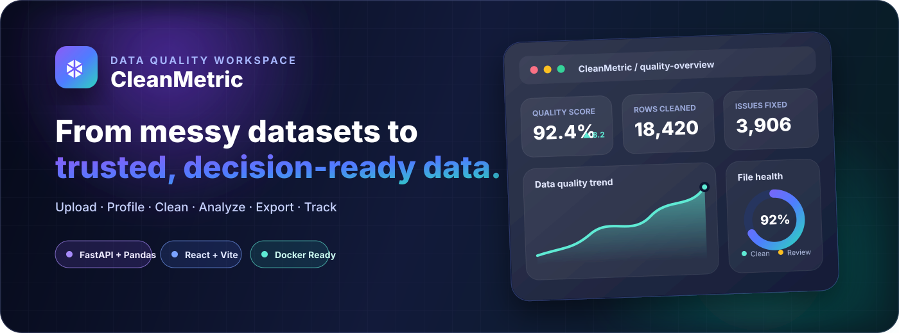
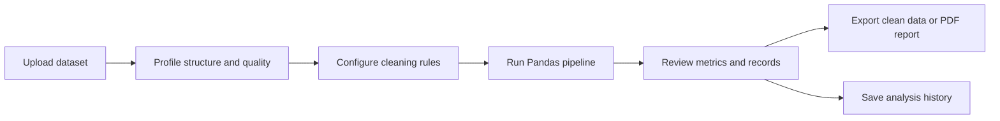
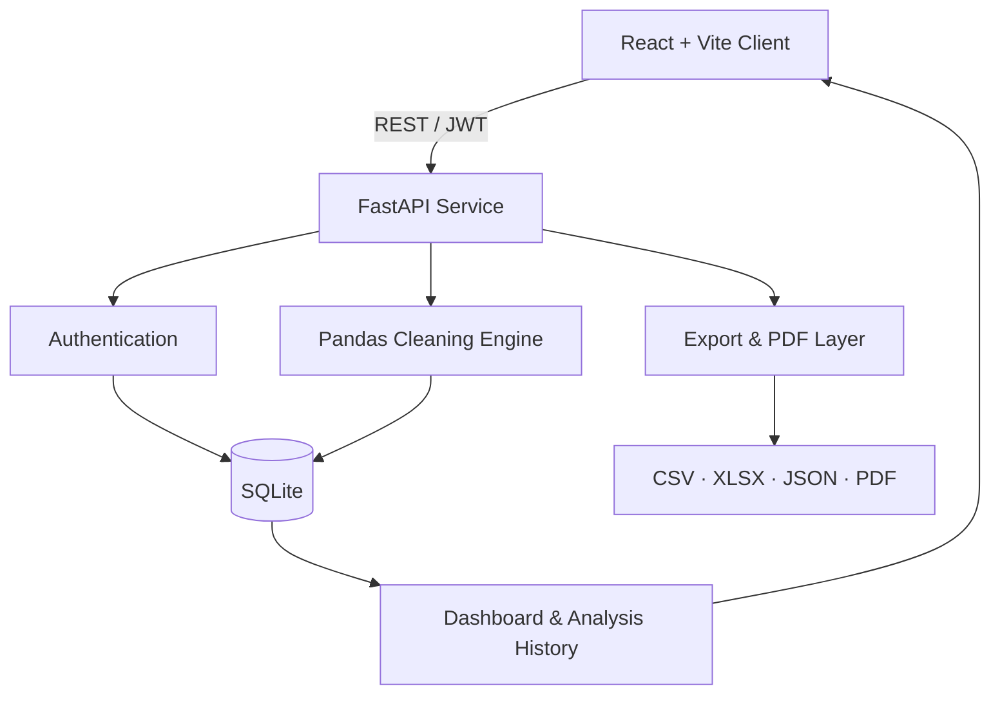

<div align="center">



<br />

[](https://github.com/shyamraj2143/cleanmatric/actions/workflows/ci.yml)


### A full-stack workspace for turning raw structured files into clean, measurable, export-ready datasets.

[**Open Website**](https://cleanmatric.site.je/) · [**Explore Architecture**](docs/ARCHITECTURE.md) · [**Report a Bug**](https://github.com/shyamraj2143/cleanmatric/issues/new?template=bug_report.yml) · [**Request a Feature**](https://github.com/shyamraj2143/cleanmatric/issues/new?template=feature_request.yml)

</div>

---

## Product overview

CleanMetric brings data import, profiling, cleaning, validation, visualization, history, and export into one authenticated workspace. It is designed for students, analysts, teams, and developers who need a clear path from inconsistent records to dependable results.

<table>
<tr>
<td width="33%" valign="top">

### ⚡ Smart cleaning

Normalize columns, trim values, remove duplicates, handle missing data, standardize casing and dates, and inspect outliers through configurable rules.

</td>
<td width="33%" valign="top">

### 📊 Measurable quality

Review completeness, uniqueness, validity, consistency, issue counts, distributions, numeric summaries, and an overall quality score.

</td>
<td width="33%" valign="top">

### 📦 Ready to use

Search cleaned records, revisit analysis history, download processed datasets, and generate professional PDF quality reports.

</td>
</tr>
</table>

## What the product experience looks like

```text
┌─────────────────────────────────────────────────────────────────────┐
│  CleanMetric                                          User Profile  │
├─────────────────────────────────────────────────────────────────────┤
│                                                                     │
│  Data Quality Overview                    Quality Score   92.4%      │
│  ─────────────────────                    Rows Cleaned    18,420     │
│                                                                     │
│  Upload → Configure → Process → Inspect → Export → Reopen History   │
│                                                                     │
│  Quality Trend          Cleaning Status          Recent Analyses     │
│  ╭──────────────╮       ● Cleaned   92%          sales_data.xlsx     │
│  │       ╭──────╯       ● Warnings    6%          customers.csv       │
│  ╰───────╯              ● Invalid     2%          audit_records.json  │
│                                                                     │
└─────────────────────────────────────────────────────────────────────┘
```

The public website explains the product before authentication. After sign-in, users enter a private workspace containing dashboards, uploads, analysis details, history, exports, and settings.

## Core capabilities

| Area | Capability |
| --- | --- |
| **Import** | CSV, TSV, Excel, JSON, TXT, and LOG files up to 20 MB |
| **Profiling** | Data types, missing values, duplicates, category distributions, numeric summaries, and IQR outliers |
| **Cleaning** | Column normalization, whitespace trimming, empty-row removal, deduplication, missing-value rules, casing, dates, and outlier handling |
| **Quality scoring** | Completeness, uniqueness, validity, consistency, and combined quality score |
| **Workspace** | Email/password authentication, optional Google Identity, user profile, private history, and protected routes |
| **Dashboard** | Volume, quality, issue, trend, status, file-type, and recent-analysis views |
| **Records** | Searchable and paginated cleaned-record preview with an auditable cleaning summary |
| **Exports** | CSV, XLSX, JSON, and PDF data-quality reports |
| **Reliability** | Automated frontend, backend, container, CORS, and integration validation through GitHub Actions |

## How it works



1. **Upload** a supported structured file.
2. **Choose** how missing values, casing, dates, duplicates, and outliers should be handled.
3. **Process** the dataset through the FastAPI and Pandas pipeline.
4. **Inspect** quality metrics, warnings, distributions, summaries, and cleaned records.
5. **Export** the result or reopen it later from the authenticated history.

## Architecture



A deeper engineering view is available in [**docs/ARCHITECTURE.md**](docs/ARCHITECTURE.md).

## Technology stack

<table>
<tr>
<td width="50%" valign="top">

### Frontend

- React 18
- Vite 8
- React Router
- Recharts
- Vitest
- Testing Library

</td>
<td width="50%" valign="top">

### Backend and data

- Python
- FastAPI
- Pandas
- SQLite
- OpenPyXL
- ReportLab
- Google Auth
- Pytest

</td>
</tr>
<tr>
<td width="50%" valign="top">

### Delivery

- Docker
- Railway configuration
- Runtime environment variables
- Production bundle validation

</td>
<td width="50%" valign="top">

### Automation

- Frontend test and build job
- Backend test job
- Backend container smoke test
- Frontend–backend integration test

</td>
</tr>
</table>

## Repository structure

```text
cleanmatric/
├── .github/
│   ├── ISSUE_TEMPLATE/        # Structured bug and feature forms
│   ├── pull_request_template.md
│   └── workflows/             # CI and integration validation
├── backend/                   # FastAPI, Pandas, persistence and exports
├── frontend/                  # React website and authenticated workspace
├── docs/
│   ├── assets/                # Repository presentation artwork
│   └── ARCHITECTURE.md        # System design and data flow
├── CONTRIBUTING.md            # Contribution standards
├── SECURITY.md                # Responsible disclosure policy
├── Dockerfile                 # Production container configuration
├── railway.toml               # Railway deployment settings
└── README.md                  # Project showcase and setup guide
```

## Run locally

### 1. Clone the repository

```bash
git clone https://github.com/shyamraj2143/cleanmatric.git
cd cleanmatric
```

### 2. Start the backend

```bash
cd backend
python -m venv .venv
source .venv/bin/activate  # Windows: .venv\Scripts\activate
pip install -r requirements.txt -r requirements-dev.txt
export JWT_SECRET="replace-with-a-long-random-secret"
uvicorn app.main:app --reload --port 8000
```

### 3. Start the frontend

```bash
cd frontend
npm ci
cp .env.example .env 2>/dev/null || true
npm run dev
```

For local development, set:

```env
VITE_API_BASE_URL=http://127.0.0.1:8000
```

## Environment variables

| Variable | Used by | Purpose | Typical local value |
| --- | --- | --- | --- |
| `DATABASE_URL` | Backend | SQLite database URL | `sqlite:///./metricflow.db` |
| `JWT_SECRET` | Backend | Signs authentication tokens | Required secure random value |
| `ALLOWED_ORIGIN` | Backend | Comma-separated frontend origins | `http://localhost:3000` |
| `GOOGLE_WEB_CLIENT_ID` | Backend | Optional Google Identity verification | Unset when disabled |
| `VITE_API_BASE_URL` | Frontend | Public backend API base URL | `http://127.0.0.1:8000` |
| `VITE_GOOGLE_WEB_CLIENT_ID` | Frontend | Optional Google Identity button | Unset when disabled |

> [!IMPORTANT]
> Never commit `.env` files, databases, credentials, OAuth secrets, access tokens, or real private datasets.

## API highlights

| Method | Endpoint | Purpose |
| --- | --- | --- |
| `POST` | `/api/v1/files/analyze` | Upload, profile, clean, and store a dataset |
| `GET` | `/api/v1/analyses` | Retrieve paginated analysis history |
| `GET` | `/api/v1/analyses/{id}/records` | Search and paginate cleaned records |
| `GET` | `/api/v1/analyses/{id}/export/{format}` | Export CSV, XLSX, JSON, or PDF |
| `GET` | `/api/v1/dashboard/summary` | Retrieve dashboard summary metrics |
| `GET` | `/health` | Verify service health |

Interactive OpenAPI documentation is available at `/docs` while the backend is running.

## Validation

```bash
cd backend && pytest -q
cd frontend && npm test && npm run build
```

The GitHub Actions workflow also validates the production containers and the connected frontend–backend runtime path.

## Deployment notes

<details>
<summary><strong>Frontend service</strong></summary>

Set the following values in the frontend deployment environment:

```env
VITE_API_BASE_URL=https://your-backend-domain.example
VITE_GOOGLE_WEB_CLIENT_ID=your-google-web-client-id
```

</details>

<details>
<summary><strong>Backend service</strong></summary>

Set the following values in the backend deployment environment:

```env
JWT_SECRET=use-a-long-random-production-secret
ALLOWED_ORIGIN=https://your-frontend-domain.example
GOOGLE_WEB_CLIENT_ID=your-google-web-client-id
```

Use persistent storage or a managed database strategy when production history must survive service replacement.

</details>

## Engineering standards

- [Contribution guide](CONTRIBUTING.md)
- [Security policy](SECURITY.md)
- [Architecture documentation](docs/ARCHITECTURE.md)
- [Bug report form](https://github.com/shyamraj2143/cleanmatric/issues/new?template=bug_report.yml)
- [Feature request form](https://github.com/shyamraj2143/cleanmatric/issues/new?template=feature_request.yml)

---

<div align="center">

### Clean data. Clear metrics. Confident decisions.

Built with **React**, **FastAPI**, and **Pandas**.

[Back to top](#)

</div>
