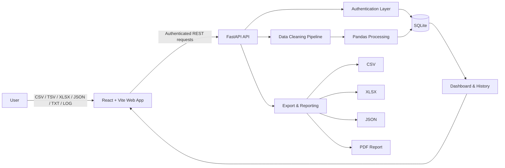
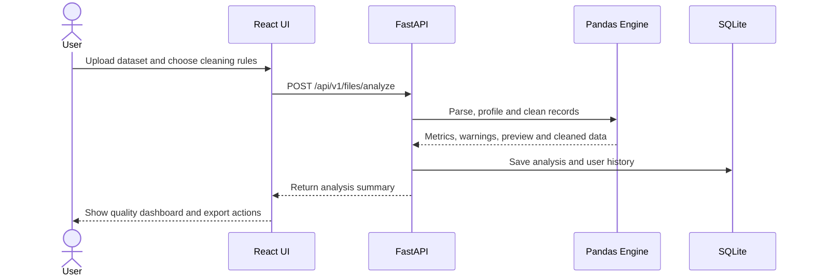

# CleanMetric Architecture

CleanMetric is organized as a full-stack data-quality workspace with a React client, a FastAPI service, a Pandas processing pipeline, and persistent per-user analysis history.

## System map

## Processing lifecycle

## Repository boundaries

| Area | Responsibility |
| --- | --- |
| `frontend/` | Public website, authentication UI, dashboards, upload flow, history, settings and visual analytics |
| `backend/` | API routes, authentication, analysis lifecycle, data-quality logic, persistence and exports |
| `.github/workflows/` | Automated frontend, backend, container and integration validation |
| `docs/` | Product presentation and engineering documentation |
| `Dockerfile` / `railway.toml` | Production container and Railway deployment configuration |

## Quality dimensions

CleanMetric calculates and presents several practical dimensions:

- **Completeness** — how much required data is present.
- **Uniqueness** — how effectively duplicate records are controlled.
- **Validity** — whether values conform to expected types and rules.
- **Consistency** — whether formatting and categories remain coherent.
- **Overall quality** — a combined, decision-friendly score.

## Security model

- User workspaces are isolated through authenticated API access.
- Passwords are hashed before persistence.
- JWT-based sessions protect private routes.
- Google Identity can be enabled with an environment-provided client ID.
- Secrets, database files and environment files must remain outside version control.

## Deployment model

The repository supports independent frontend and backend services as well as container-based validation. Production configuration is supplied through environment variables, keeping runtime credentials separate from the repository.
